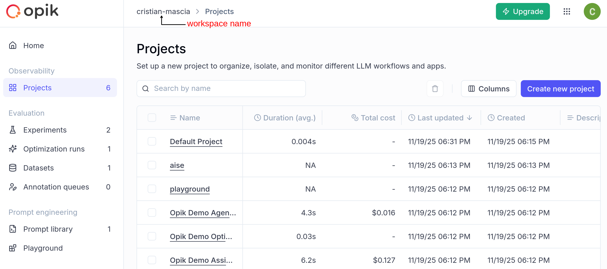
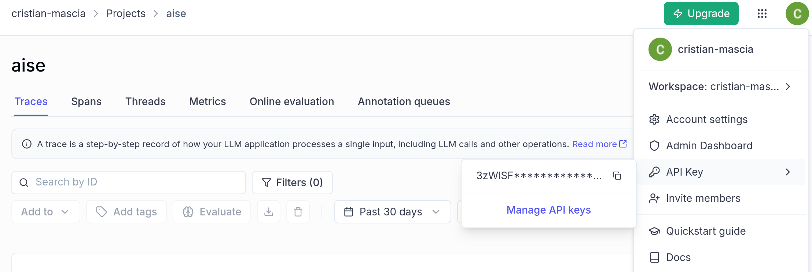

# 📚 NotebookLM — Local NotebookLM

**NotebookLM** is a digital assistant that transforms your study documents into a knowledge base you can query in natural language.  
Based on **Retrieval-Augmented Generation (RAG)** techniques, it allows you to upload PDFs, ask questions, receive answers with source citations, get summaries and study guides, and even listen to the content via text-to-speech.

---

## 👥 Who It's For

- **Students**: can upload notes, handouts, or books and get explanations, study outlines, and quizzes.  
- **Teachers and Researchers**: a quick tool to consult their teaching and scientific materials, useful for preparing lessons or seminars.

---

## 🧭 Objective

To provide study support that is **reliable, transparent, and personalized**, without replacing the role of the teacher or student, but acting as a **learning partner**.  
Answers are always accompanied by source citations, allowing the user to verify and explore further.

---

## 🔐 Design Principles

- **Privacy**: documents are managed and indexed locally in FAISS, without being sent to external databases.  
- **Transparency**: every answer includes the sources it was drawn from.  
- **Reliability**: the model is constrained to use only the uploaded content, reducing the risk of hallucinations.  
- **Ethics**: aligned with European principles **ALTAI** and **FASTEPS** for responsible AI.


---

## 🛠️ Technologies Used

### `Streamlit`
- **What it is:** An open-source Python framework for building interactive web apps.
- **Purpose in NotebookLM:** Provides a simple, responsive interface for uploading documents, asking questions, and receiving answers.
- **Key features:** Widgets, layout customization, real-time interaction.

### `LangChain`
- **What it is:** A framework for building applications that combine language models with external data sources.
- **Structure:**
  - **LangChain Core** — foundational tools for chaining prompts and models.
  - **LangChain Community** — additional integrations, connectors, and helpers.
- **Purpose in NotebookLM:** Orchestrates the RAG pipeline to handle queries over uploaded PDFs.
- 
### `LangChain_Google_GenAI` + `google-generativeai`
- **What it is:** Integration with Google’s Gemini LLM for embeddings and generation.
- **Purpose:** Provides high-quality language understanding and generation, including embedding generation for RAG.

### `FAISS-cpu`
- **What it is:** Facebook AI Similarity Search, a library for efficient vector similarity search.
- **Purpose:** Stores embeddings locally for fast retrieval, ensuring privacy and offline capability.

### `PyPDF` & `PyMuPDF`
- **What they are:** Python libraries for parsing and extracting text from PDF documents.
- **Purpose:** Converts study materials into a structured format for indexing and querying.

### `pyttsx3`
- **What it is:** Offline text-to-speech library for Python.
- **Purpose:** Allows users to listen to study content without sending data to external TTS services.

### `RAGAS`
- **What it is:** A framework for evaluating RAG systems.
- **Metrics used:** Faithfulness, relevance, precision, recall.
- **Purpose:** Quantitative evaluation of how accurately the system answers questions based on provided content.

### `Opik`
- **What it is:** Tool for monitoring, tracing, and auditing AI interactions.
- **Purpose:** Tracks user interactions, collects feedback, and supports human-in-the-loop verification.

### `Datasets`, `Pandas`, `Openpyxl`
- **What they are:** Libraries for data handling, analysis, and CSV export.
- **Purpose:** Manage and export document metadata, evaluation results, and user interactions.

### `python-dotenv`
- **What it is:** Loads environment variables from a `.env` file into Python.
- **Purpose:** Keeps API keys and configuration separate from code for security and convenience.

---


## How to build a RAG chain with langchain?
The RAG comprises four steps:  

1. **Document Loading and Chunking**  
   Documents (e.g., text files, PDFs, CSVs, etc.) are parsed and split into chunks. A chunk can be a piece of text or, for example, a row of a CSV file. There are several approaches to split documents into chunks; the most well-known are **fixed-size splitting** and **semantic splitting**.  
   - **Fixed-size splitting:** Defines a number of words (or tokens) per chunk, optionally with overlap between adjacent chunks.  
   - **Semantic splitting:** Uses embeddings to create chunks based on semantic meaning. The goal is to generate chunks that are meaningful, self-contained, and semantically distinct from one another.  

2. **Chunk Embedding and Storing**  
   To select the most relevant chunks, a numerical representation is needed. Embedder models are trained to represent text as vectors. Each chunk is transformed into an embedding vector using an embedder model. To efficiently search for relevant chunks, these embeddings are stored in a vector database (e.g., FAISS, ChromaDB, etc.).  

3. **Vector Store Search**  
   The next step is to search for the most relevant chunks in the vector database. This typically involves finding chunks that are most similar to the user query, often using measures like cosine similarity.  

4. **LLM Response Generation**  
   The retrieved chunks are used to augment the prompt, which is then provided to the LLM. The model generates answers using the retrieved context.


For an example of RAG implementation with LangChain, see the **"Example RAG LangChain"** notebook.

## What is Opik?

From the Opik documentation:

```Opik is an open-source logging, debugging, and optimization platform for AI agents and LLM applications. If you’re building AI features, you know it’s easy to spin up a working prototype but harder to log, test, iterate, and monitor to meet production requirements.

Opik gives you all the tools you need to go from LLM observability to action across your AI application footprint and dev cycle. Ship measurable improvements with gorgeous logs, annotation and scoring functions, pre-configured LLM-as-a-judge eval metrics, and even automated agent optimization algorithms to maximize performance.
```

In order to use OPIK, you should create an account on [Opik](https://www.comet.com/opik/) for free.
Then, you should create a new project. 


Finally, you should get the api key.




## What is Ragas?

**Ragas** is a library that helps you move from "vibe checks" to systematic evaluation loops for your AI applications.  
Ragas allows you to **systematically improve LLM applications** while maintaining reproducibility and scalability.

---

### Why Ragas?

Traditional evaluation metrics often **don't capture what matters** for LLM applications.  
Manual evaluation **doesn't scale**.  

**Ragas solves this** by combining LLM-driven metrics with systematic experimentation to create a **continuous improvement loop** for your AI applications.

---

### Key Features

#### 1. Experiments-First Approach
- Evaluate changes consistently with experiments.  
- Make changes, run evaluations, observe results, and iterate to improve your LLM application.  

#### 2. Ragas Metrics
- Create **custom metrics** tailored to your use case using simple decorators.  
- Or use the library of **predefined metrics** provided by Ragas.  
- Learn more about metrics in [Ragas Metrics Documentation](#).

#### 3. Easy Integration
- Built-in dataset management and result tracking.  
- Integration with popular frameworks like:
  - LangChain  
  - LlamaIndex  
  - And more  

---


## ⚙️ Installation

1. **Clone repository**
   ```bash
   git clone https://github.com/alessiamanna/NotebookLM.git
   cd NotebookLM
   ```

2. **Create and Activate virtual environment Python**  
   ```bash
   conda create -n NotebookLM python=3.11
   conda activate NotebookLM
   ```

3. **Install dependencies**
   ```bash
   pip install -r requirements.txt
   ```

4. **Populate env file .env**
   ```
   GOOGLE_API_KEY=...
   OPIK_API_KEY=...
   OPIK_WORKSPACE=...
   ```

5. **Start NetworkLM**
   ```bash
   streamlit run app.py
   ```

---

## 🐳 Deploy with Docker

1. **Build of the image**
   ```bash
   docker build -t aise-chatbot .
   ```

2. **Run the container**
   ```bash
   docker run --rm -p 8501:8501 --env-file .env aise-chatbot
   ```

3. **Docker Compose** (optional)
   ```bash
   docker compose up --build
   ```

---

## 📊 Testing and Evaluation

NotebookLM integrates tools for evaluating RAG performance: **Opik** and **RAGAS**.

The dedicated scripts are:
```bash
python ragas_eval.py
python eval_opik.py
```

### Opik Evaluation

The ```eval_opik.py``` script containts evluation for 

#### 🔧 What This Script Does

- **Loads a ground-truth dataset** containing questions and reference answers.  
- **Builds a RAG pipeline** using a backend-defined retrieval + generation chain.  
- **Runs the RAG chain for each question**, collecting:
  - generated answer  
  - retrieved contexts  
- **Constructs a HuggingFace `Dataset`** ready for RAGAS evaluation.  
- **Evaluates the RAG system** on the four standard RAGAS metrics:
  - `context_precision`
  - `context_recall`
  - `faithfulness`
  - `answer_relevancy`
- **Computes average metric scores** for quick comparison.  
- **Exports all results to Excel** (`results_ragasopik.xlsx`).  
- **Logs all metrics and metadata to Opik**, enabling experiment tracking and reproducibility.

---

#### 🧩 Key Components

##### **Google Gemini Models**
The evaluation uses:
- `gemini-2.0-flash` (LLM for scoring)
- `text-embedding-004` (embeddings for similarity)

These models support the RAGAS scoring process.

##### **Opik Integration**
The script integrates with **Opik** using:
- `@track` decorators  
- `opik_context.update_current_trace()` for metric logging  
- `Opik().flush()` to ensure logs are written before exit  

This enables full experiment tracking and comparison across runs.

##### **RAG Execution**
`run_rag_for_question()` executes the RAG chain and returns:
- the generated answer  
- the retrieved contexts  

##### **RAGAS Evaluation**
`run_ragas()`:
- runs RAGAS metrics on the dataset  
- returns row-level scores  
- computes summary averages  
- prepares results for export and tracking  

---

##### 📄 Output Files

This script builds a `results_ragasopik.xlsx` file contains the RAGAS metrics. In addition, the matrics are logged into **Opik** .

---

##### ▶️ How to Run

```bash
python eval_opik.py
```

####

In addition, a `ragas_eval.py` script is provided for running the RAGAS evaluation without tracking results through Opik.
